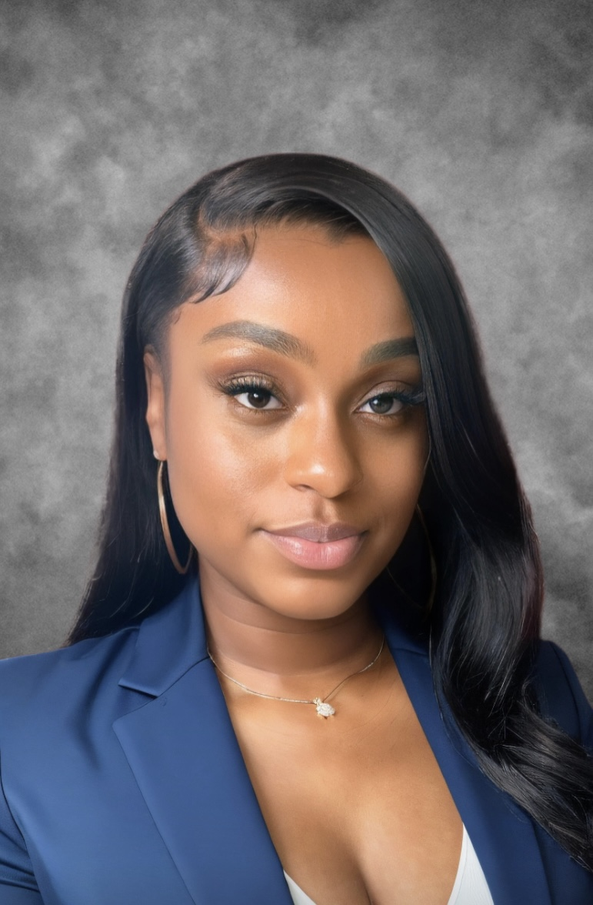

  

# Who am I?

Hey there! I'm Brianna Carnagie, a passionate advocate for healthcare equity and a recent graduate of Columbia University Mailman School of Public Health.

## What's my story?

I'm dedicated to making a positive impact in public health, with a focus on Epidemiology, Applied Biostatistics, and Public Health Data Science. With over 3 years of experience, I've worked closely with vulnerable populations, using biostatistics and data analytics to drive change.

## Let's Connect!

Ready to explore my journey and projects? Click below to dive in!

[Explore My Work](https://bcarnagie.github.io/Projects.html)

---
