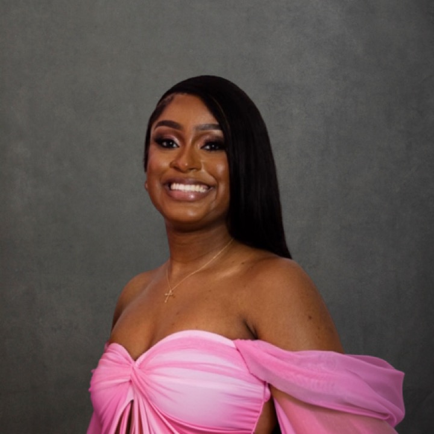

  

# Who am I?

Hey there! I'm Brianna Carnagie, a passionate advocate for healthcare equity and a recent graduate specializing in Epidemiology, Applied Biostatistics, and Public Health Data Science from Columbia University Mailman School of Public Health.

## What's my story?

I am committed to leveraging data science to advance public health initiatives, focusing on improving health outcomes for underserved communities. With over 3 years of experience, I've collaborated extensively with diverse populations, applying biostatistics and data analytics to drive impactful change.

## Let's Connect!

Excited to explore my journey and projects? Click below to dive in!

[Explore My Work](https://bcarnagie.github.io/Projects.html)

---
